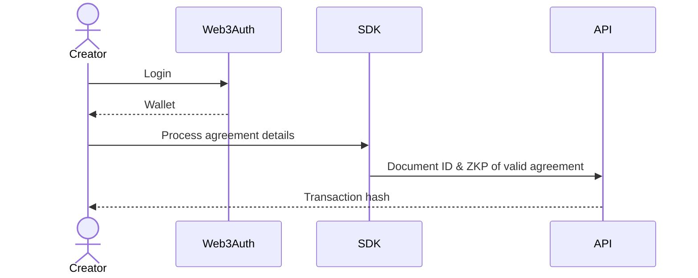
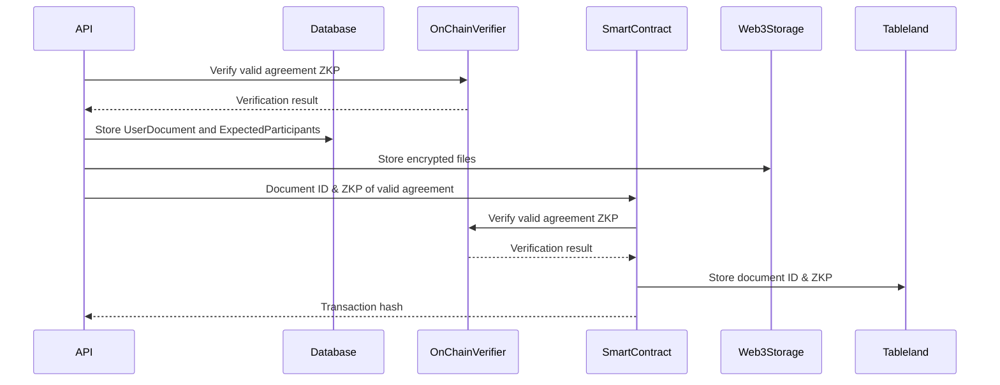

import pdfTree from "./img/pdf-tree.png";

# Overview

A new agreement is primary processed in a user's browser (see [Agreement Processing](./agreement-processing.md))
with the zksig SDK. The in-browser processing results in:

- Document ID
- Expected Participants
- Encrypted PDF
- Encrypted Details
- Encrypted Encryption Key
- Zero Knowledge Proof of Valid Agreement

This information is sent to the zksig API where it is verified and stored.

## In-Browser

## zksig API

