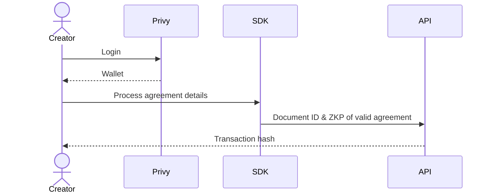
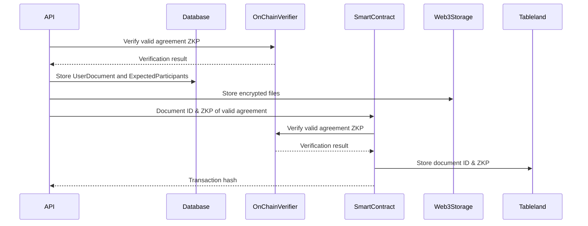

# Overview

Using the zkSig SDK, a new agreement is processed in a user's browser (see [Agreement Processing](./agreement-processing.md)).
The in-browser processing results in:

- **Document ID** - the root hash of an SMT containing details about an agreement
- **Expected Participants** - participants invited to insert signatures into the **Audit Trail**
- **Encrypted PDF** - an encrypted version of the agreement PDF
- **Encrypted Details** - an encrypted version of the data used to create the document ID SMT
- **Encrypted Encryption Key** - an encrypted version of the randomly generated bytes used to encrypt the agreement PDF and details
- **Zero Knowledge Proof of Valid Agreement** - a proof that the document ID is valid and a result of the proper processing

This information is sent to the zkSig API where it is verified and stored.

## In-Browser

## zkSig API

