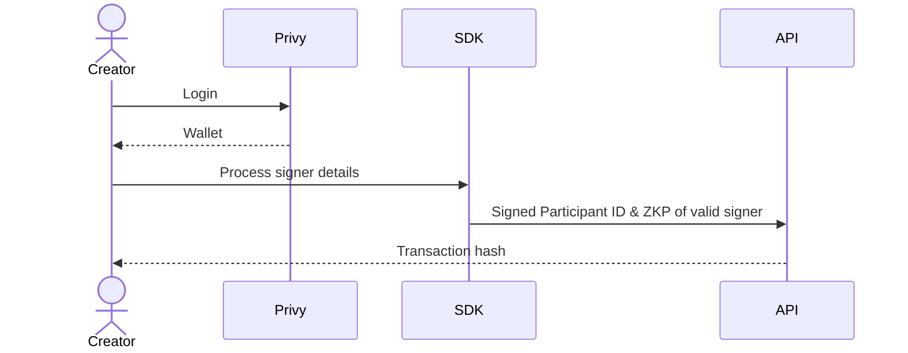
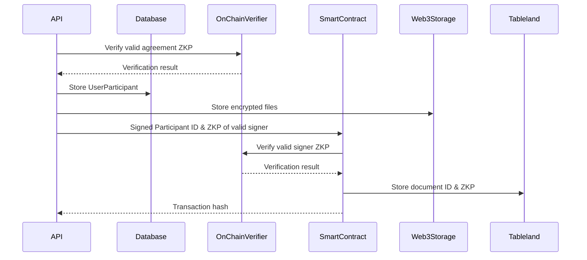

# Overview

Using the zkSig SDK, a new agreement signatures is processed in a user's browser (see [Agreement Processing](../agreement-creation/agreement-processing.md))
and then added to a public audit trail. The in-browser processing results in:

- **Participant ID** - the root hash of an SMT containing details about a signer
- **Signed Participant ID** - a singed participant ID using [EdDSA](https://en.wikipedia.org/wiki/EdDSA)
- **Audit Trail Root** - the root hash of an SMT representing all agreement participants

This information is sent to the zkSig API where it is verified and stored.

## In-Browser

## zkSig API

