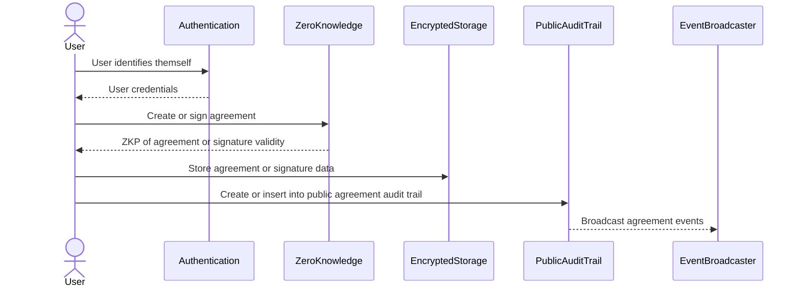
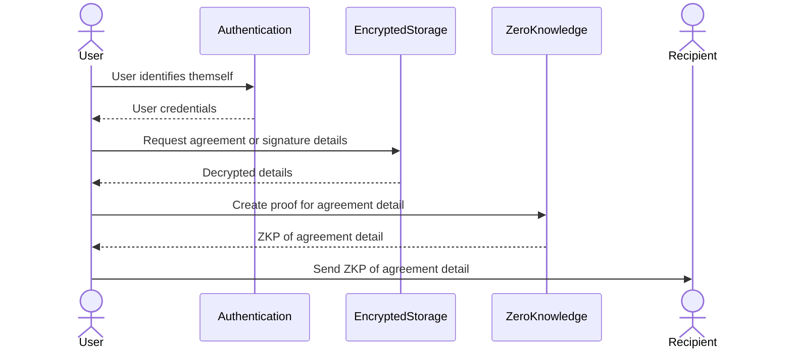
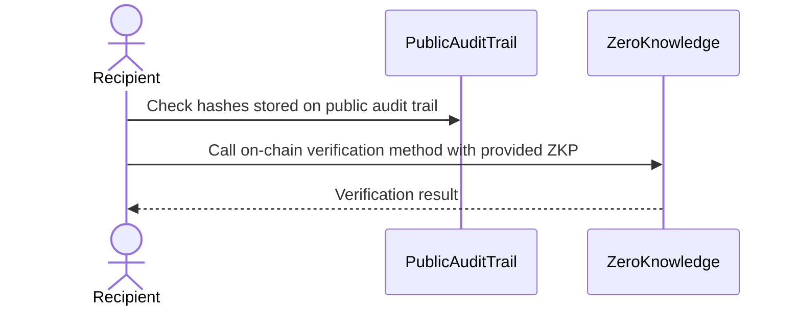

# Architecture

## Modules

zkSig is comprised of the following modules:

- **Authentication** - user provides credentials to prove who they are
- **Encrypted Storage** - used to store encrypted files containing details about agreements and signatures
- **Public Audit Trail** - a chronological record of agreement events stored in public as hashes
- **Event Broadcaster** - listens to agreement events and broadcasts messages to smart contracts and webhooks

Because of the modular design, zkSig can scale into new jurisdictions and new use cases by implementing
different versions of the above modules. For example, currently we use [Web3Auth](https://web3auth.io/)
to handle authentication. However, in the future we can implement new authentication modules like Decentralized
Identity or Centralized Public Key.

## Features & Flows

The above modules are composed in different to create different features and user flows.

### Create & Sign Agreement

### Share Agreement Detail

A `User` can share details about an agreement with a `Recipient`  by creating a zero knowledge proof
in-browser.

The `Recipient` can then verify the zero knowledge proof shared with them using an on-chain verifier.

### Smart Contract Hooks

