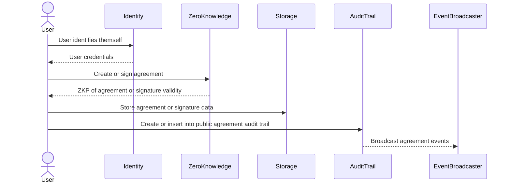
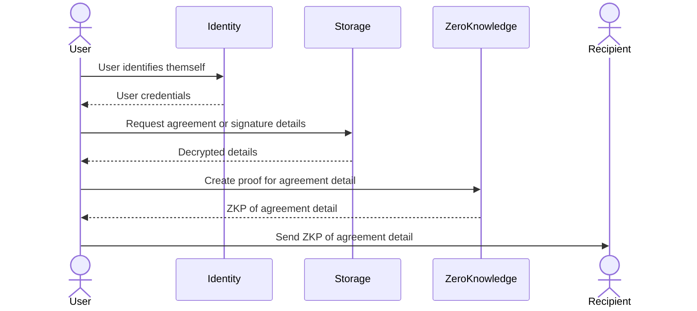
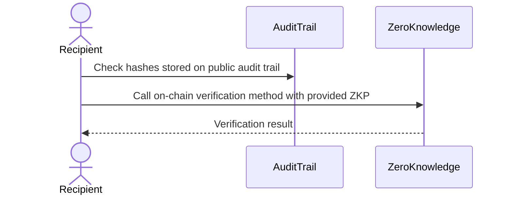
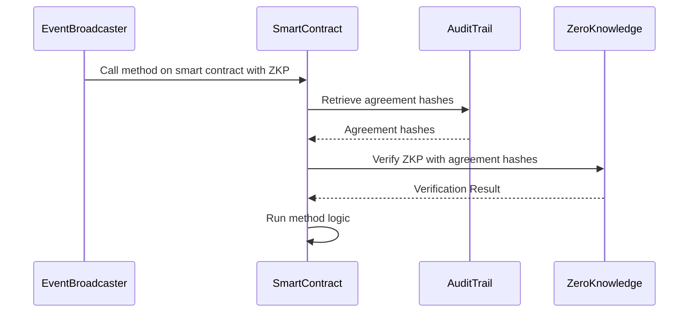

# Architecture

## Modules

- **Identity** - primitives for identifying a user, signing messages, and encrypting data
- **Zero Knowledge** - primitives for proof generation and verification
- **Storage** - primitives for saving and retrieving files from persistent storage
- **Audit Trail** - a service for creating, updating, and accessing a chronological record of agreement events
- **Event Broadcaster** - services used to broadcast messages to smart contracts and webhooks

Novel implementations of these modules can be implemented to cover new jurisdictions and unforeseen use cases.
For example, currently we use [Privy](https://privy.io/) to handle **identity**. However, in the future we
can implement new **identity** modules like [Decentralized Identity](https://polygon.technology/polygon-id) or
[Centralized Certificate Authorities](https://en.wikipedia.org/wiki/Certificate_authority). Similarly, we can
implement new **event broadcasters** to send to agreement events to any blockchain.

## Features & Flows

The above modules are composed to create features and user flows.

### Create & Sign Agreement

### Share Agreement Detail

A `User` can share details about an agreement with a `Recipient` by creating a zero knowledge proof
in-browser.

The `Recipient` can then verify the zero knowledge proof shared with them using an on-chain verifier.

### Smart Contract Hooks

