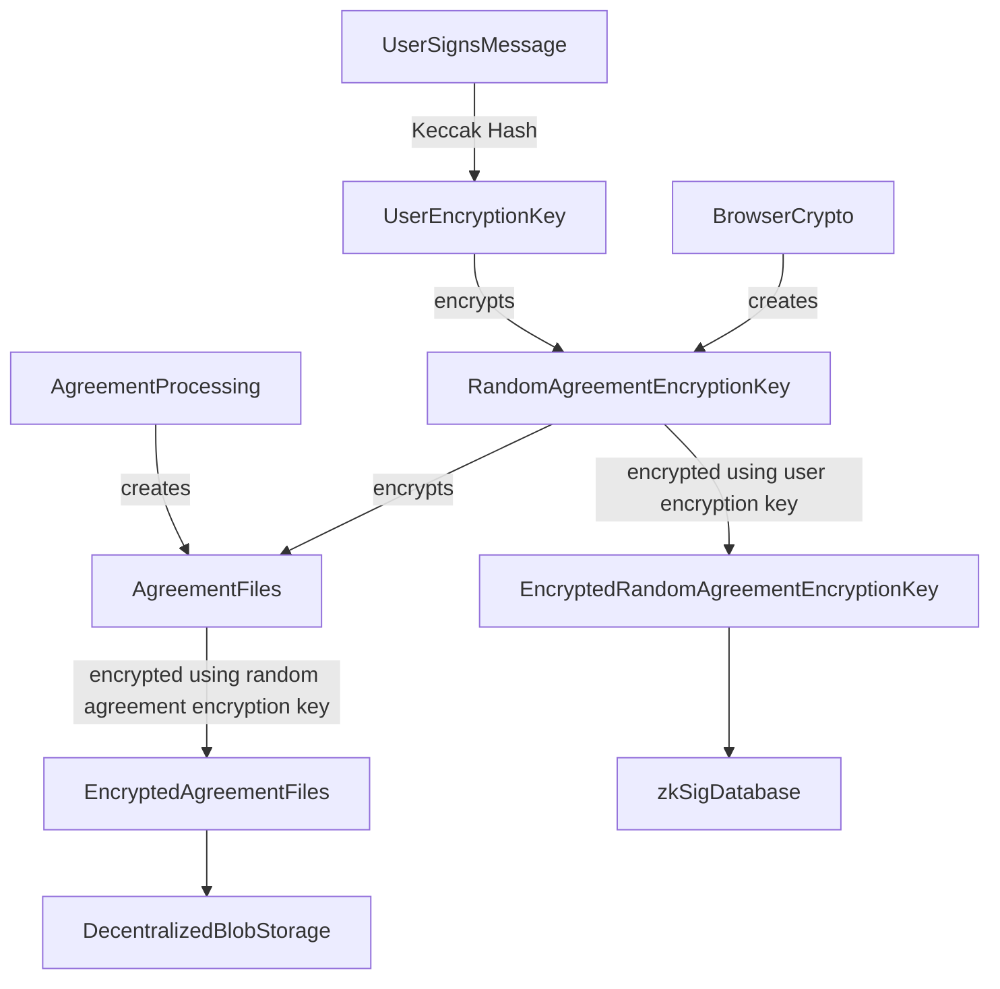

# Storage and Encryption

All agreement data is processed in a user's browser, encrypted in browser with keys accessible only to the
user, and then stored using standard decentralized storage mechanisms.

## Data Processing

### Agreement Creation

During creation two types of agreement files are created and stored:

- Agreement PDF (see [Agreement Processing](./agreement-creation/agreement-processing.md) for more details)
- Agreement Details (used to reconstruct a [sparse merkle tree](https://wiki.polygon.technology/docs/zkEVM/zkProver/sparse-merkle-tree/) to facilitate zero knowledge agreement sharing)

These files are processed and created in a user's browser and never touch zkSig servers.

### Agreement Signing

During signing, a _participant details_ file (used to reconstruct a [sparse merkle tree](https://wiki.polygon.technology/docs/zkEVM/zkProver/sparse-merkle-tree/) to facilitate zero knowledge agreement sharing)
is created. This file is created in a user's browser and never touches the zkSig servers.

## Encryption

All data is encrypted using [xsalsa20](https://www.xsalsa20.com/) by way of [tweetnacl secretbox](https://www.npmjs.com/package/tweetnacl#secret-key-authenticated-encryption-secretbox).
To encrypt data two types of encryption keys are used:

- Agreement encryption key
- User encryption key

### Agreement Encryption Keys

A random 32 byte encryption key is created in browser using [`crypto.getRandomValues`](https://developer.mozilla.org/en-US/docs/Web/API/Crypto/getRandomValues)
for every agreement. These encryption keys are used to encrypt agreement PDFs, agreement details, and participant details before storage.

### User Encryption Key

Each user has only one _user encryption key_ created by signing a message with their wallet (for now wallets are created using [Privy](https://www.privy.io/)
and [signing happens through their SDK](https://docs.privy.io/guide/frontend/embedded/usage#signing-messages)). This signed message is then hashed using
[Keccak-256](https://en.wikipedia.org/wiki/SHA-3) to create a 32 byte encryption key. This key is used to encrypt _agreement encryption keys_ before storage.

### Encrypting Agreement Encryption Keys

_Agreement encryption keys_ are encrypted using a user's _user encryption key_, the encrypted value is then sent to zkSig servers, and finally stored as a column in a database.
These keys are only able to be decrypted in a user's browser.

### File Encryption

We encrypt agreement PDFs, agreement details, and participant details using _agreement encryption keys_, the encrypted values are then sent to zkSig servers, and finally uploaded to Filecoin/IPFS
using [web3.storage](https://web3.storage).

## On-Chain

We store the document ID, status (pending or complete), and ZKP of valid document ID on-chain for every agreement created.

## Tableland

We store a full ZK audit trail using Tableland. For an agreement this includes document ID, status (pending or complete), a ZKP that the document ID
represents a valid agreement.

Additionally an new row in Tableland is created for each signature on an agreement. This row includes document ID, a EdDSA signed SMT root hash representing details about a signer,
an IPFS CID to an encrypted participant details JSON file, the SMT root hash representing all participants on an agreement, and a ZKP proving that the row represents a signer
that has been inserted into the audit trail.
